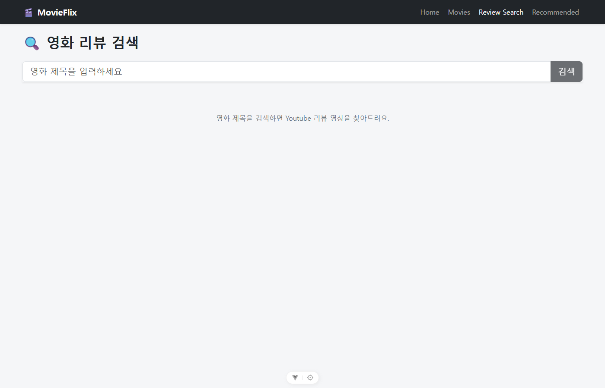
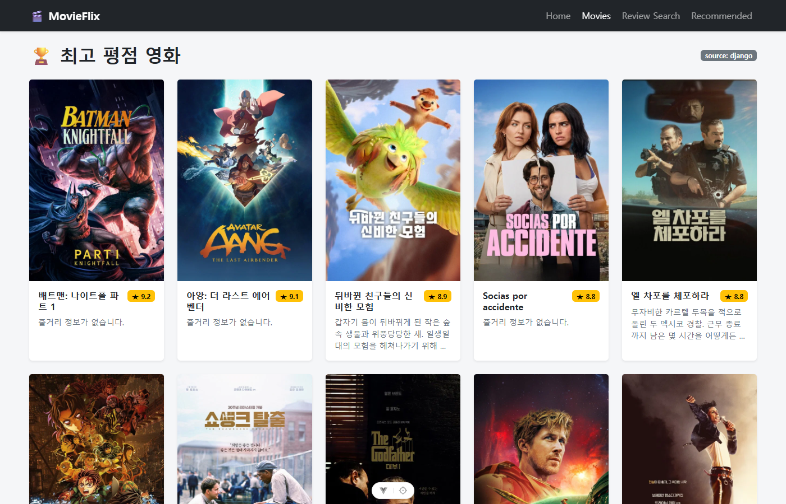
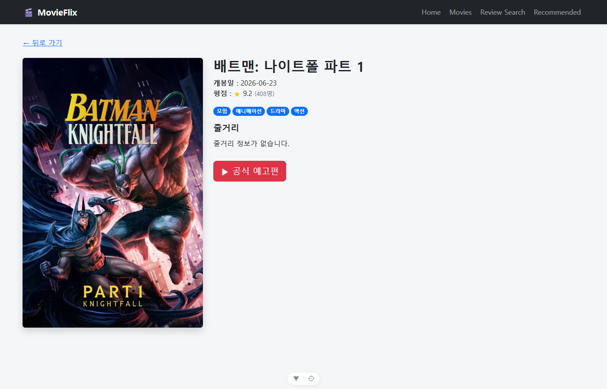
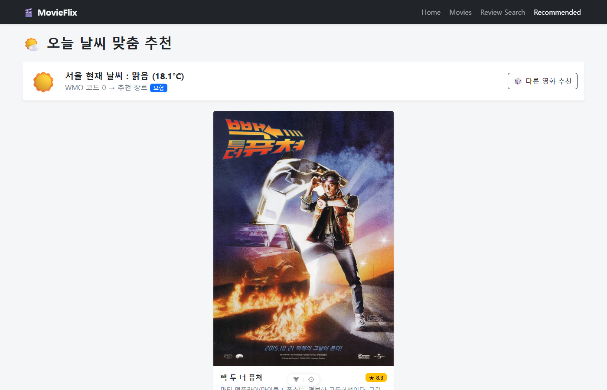

# 🎬 [PJT 03] Vue를 활용한 SPA 영화 서비스 구성

> **진행 일자**: 2026.10.02 (금)  
> **제출 마감**: **당일 18:00까지 (GitLab)**  
> **예상 시간**: 필수 기능 (5시간) + 추가/도전 기능 (3시간)  
> **GitLab 레포지토리명**: `03-pjt`

---

## 작업 로드맵 (오늘의 작업 타임라인)

```
[0단계] 환경 세팅 & API Key 준비 (~10:30)
   ↓
[1단계] Vue 프로젝트 생성 & 라우터/컴포넌트 뼈대 세팅 (~11:30)
   ↓
[2단계] 필수 기능 구현 (F01 ~ F04) (~15:00)
   ├─ F01: TMDB 최고 평점 영화 목록 (MovieListView)
   ├─ F02: 영화 상세 정보 조회 (MovieDetailView)
   ├─ F03: 영화 공식 예고편 유튜브 모달 (YoutubeTrailerModal)
   └─ F04: 영화 리뷰 검색 및 모달 (ReviewSearchView)
   ↓
[3단계] 도전 과제 구현 (F05 ~ F06) (~17:00)
   ├─ F05: Django API 연동 (TMDB 대신 Django 서버 거치기)
   └─ F06: Open-Meteo 날씨 기반 영화 추천 (RecommendedView)
   ↓
[4단계] 스타일링, 캡처본/회고 작성 & GitLab 제출 (~18:00)
```

---

## 오늘의 핵심 체크리스트 (To-Do List)

### 0. 사전 준비 및 프로젝트 셋업
- [x] **Vue 프로젝트 생성**: `my-vue-pjt` 생성 (`npm create vue@latest` 또는 Vite 기반)
- [x] **필수 라이브러리 설치**: `vue-router`, `pinia`, `axios`, `bootstrap` 등
- [x] **API 키 발급 및 `.env` 구성**:
  ```env
  VITE_TMDB_API_KEY=your_tmdb_api_key_or_token
  VITE_YOUTUBE_API_KEY=your_youtube_api_key
  ```
  *(주의: `.gitignore`에 `.env` 포함 확인)*

---

### 1. 라우터 및 네비게이션 구성 (`router/index.js`, `App.vue`)
- [x] 상단 네비게이션 바 링크 구성 (`Home`, `Movies`, `Review Search`, `Recommended`)
- [x] 라우팅 테이블 정의:
  | Path | Component | 설명 |
  | :--- | :--- | :--- |
  | `/` | `HomeView.vue` | 메인 페이지 |
  | `/movies` | `MovieListView.vue` | 전체 영화 목록 페이지 (F01) |
  | `/:movieId` | `MovieDetailView.vue` | 영화 세부 정보 페이지 (F02, F03) |
  | `/review-search` | `ReviewSearchView.vue` | 유튜브 리뷰 검색 및 재생 페이지 (F04) |
  | `/recommended` | `RecommendedView.vue` | 날씨 기반 영화 추천 페이지 (F06 - 도전) |

---

### 2. [필수] 핵심 기능 구현 (F01 ~ F04)

- [x] **[F01] 최고 평점 영화 목록 조회**
  - **컴포넌트**: `MovieListView.vue`, `MovieCard.vue`
  - **작업**:
    1. `MovieListView` 마운트 시 TMDB Top Rated API (`/movie/top_rated`) 비동기 호출
    2. `v-for`로 영화 목록 순회하며 `MovieCard`에 props 전달
    3. 포스터 이미지, 영화 제목, 줄거리 화면 출력

- [x] **[F02] 영화 상세 정보 조회**
  - **컴포넌트**: `MovieDetailView.vue`, `MovieDetailInfo.vue`
  - **작업**:
    1. `MovieCard` 클릭 시 `/:movieId`로 이동 (`RouterLink`)
    2. URL 파라미터(`route.params.movieId`)를 사용해 TMDB Detail API (`/movie/{movie_id}`) 호출
    3. `MovieDetailInfo`로 상세 데이터(제목, 개봉일, 평점, 장르, 줄거리 등) 전달 및 표시

- [x] **[F03] 영화 공식 예고편 조회**
  - **컴포넌트**: `YoutubeTrailerModal.vue` (MovieDetailView 내 버튼 연동)
  - **작업**:
    1. 영화 상세 페이지 내 **[공식 예고편]** 버튼 클릭
    2. Youtube Search API 호출 (`${title} trailer`)
    3. 첫 번째 검색 결과의 `videoId` 추출
    4. Bootstrap 모달 또는 커스텀 모달 내 `iframe`으로 유튜브 영상 재생

- [x] **[F04] 영화 리뷰 영상 검색 및 조회**
  - **컴포넌트**: `ReviewSearchView.vue`, `YoutubeCard.vue`, `YoutubeReviewModal.vue`
  - **작업**:
    1. 검색창 입력 후 검색 버튼 클릭 시 Youtube Search API 호출 (`${검색어} review`)
    2. 검색된 영상 목록을 `YoutubeCard` 카드로 출력
    3. 카드 클릭 시 `YoutubeReviewModal`을 통해 모달 창으로 해당 영상 재생

---

### 3. [도전] 추가 기능 구현 (F05 ~ F06)

- [x] **[F05] Django API 연동**
  - **작업**:
    1. 이전 관통 프로젝트(PJT02)의 Django 서버 구동 (`http://127.0.0.1:8000/api/v1/...`)
    2. TMDB 직접 호출 대신 로컬 Django RESTful API 서버로부터 영화 데이터 가져오도록 요청 엔드포인트 변경
    3. 필요 시 Django Serializer 수정

- [x] **[F06] 날씨 기반 영화 추천**
  - **컴포넌트**: `RecommendedView.vue`
  - **작업**:
    1. Open-Meteo API 호출 (서울 현재 날씨 WMO 코드 확인, API Key 불필요)
       - 예: `https://api.open-meteo.com/v1/forecast?latitude=37.5665&longitude=126.9780&current_weather=true`
    2. WMO 날씨 코드(0: 맑음, 61: 비, 71: 눈 등)에 맞는 영화 장르 매핑
    3. 매칭된 장르의 영화 중 1편을 랜덤 추천하여 화면에 표시

---

### 4. 최종 마감 및 제출 점검 (18:00 이전)

- [x] 스타일 적용 (Bootstrap 또는 아무튼 미려하게 CSS를 통한 레이아웃 정돈)
- [x] `.gitignore` 점검 (`node_modules`, `.env` 등이 git에 포함되지 않는지 확인)
- [x] 각 기능별 실행 화면 캡처본 저장
- [ ] 학습 내용, 트러블슈팅, 느낀 점을 기록한 최종 보고서 작성 (필수)
- [ ] GitLab `03-pjt` 원격 저장소에 푸시 완료

---

## 📝 구현 보고서

### 실행 방법

**1) Vue (프론트엔드)**
```bash
cd my-vue-pjt
npm install
cp .env.example .env   # 발급받은 키 입력
npm run dev            # http://localhost:5173
```

| 환경 변수 | 설명 |
| :--- | :--- |
| `VITE_TMDB_API_KEY` | TMDB v3 API Key 또는 v4 Read Access Token(`eyJ...`) — 둘 다 지원 |
| `VITE_YOUTUBE_API_KEY` | Youtube Data API v3 Key |
| `VITE_MOVIE_API_SOURCE` | `tmdb`(기본, TMDB 직접 호출) / `django`(F05, Django 서버 경유) |
| `VITE_DJANGO_API_URL` | Django API 주소 (기본 `http://127.0.0.1:8000/api/v1`) |

**2) Django (F05 · F06 백엔드)**
```bash
cd django-pjt
python -m venv venv && source venv/Scripts/activate
pip install -r requirements.txt
python manage.py migrate
TMDB_API_KEY=<키> python manage.py load_tmdb   # TMDB → DB 적재 (장르 + top_rated 5페이지 + 장르별 상위 영화)
python manage.py runserver
python manage.py test movies                   # API 테스트 6개
```

### 프로젝트 구조

```
my-vue-pjt/src
├─ api/
│  ├─ tmdb.js        TMDB axios 인스턴스 (v3/v4 인증 자동 판별, ko-KR)
│  ├─ django.js      PJT02 Django API 호출 (F05)
│  ├─ movies.js      데이터 출처 전환 레이어 — 뷰는 이 파일만 사용
│  ├─ youtube.js     Youtube 검색 / embed URL
│  └─ weather.js     Open-Meteo 조회 + WMO 코드 → 장르 매핑 (F06)
├─ components/
│  ├─ MovieCard.vue            (F01) 포스터·제목·평점·줄거리, 클릭 시 /:movieId
│  ├─ MovieDetailInfo.vue      (F02) 상세 정보 표시
│  ├─ VideoModalFrame.vue      모달 공통 틀 (Teleport, ESC/배경 클릭 닫기)
│  ├─ YoutubeTrailerModal.vue  (F03) "제목 trailer" 첫 결과 재생
│  ├─ YoutubeCard.vue          (F04) 검색 결과 카드
│  └─ YoutubeReviewModal.vue   (F04) 선택 영상 재생
├─ views/  HomeView · MovieListView · MovieDetailView · ReviewSearchView · RecommendedView
└─ router/index.js

django-pjt/
├─ movies/  models(Genre, Movie) · serializers · views · urls · tests
│  └─ management/commands/load_tmdb.py
└─ my_api/  settings (DRF, corsheaders, CORS_ALLOWED_ORIGINS=5173)
```

### Django API (F05)

| Method | Endpoint | 설명 |
| :--- | :--- | :--- |
| GET | `/api/v1/movies/` | 평점 순 상위 20편 (`id, title, overview, poster_path, vote_average`) |
| GET | `/api/v1/movies/<id>/` | 상세 정보 — `genres`를 `[{id, name}]`로 중첩해 TMDB 응답과 형태를 맞춤 |
| GET | `/api/v1/movies/recommend/?genre=<id>` | 장르 내 랜덤 1편 (F06) |
| GET | `/api/v1/genres/` | 장르 목록 + 장르별 영화 수 (`annotate(Count)`) |

### 날씨 → 장르 매핑 (F06)

| WMO 코드 | 날씨 | 추천 장르 |
| :--- | :--- | :--- |
| 0 | 맑음 | 모험 (12) |
| 1–3 | 구름/흐림 | 코미디 (35) |
| 45, 48 | 안개 | 미스터리 (9648) |
| 51–57 | 이슬비 | 드라마 (18) |
| 61–67, 80–82 | 비 | 공포 (27) |
| 71–77, 85–86 | 눈 | 로맨스 (10749) |
| 95–99 | 뇌우 | 스릴러 (53) |

### 학습 내용 & 트러블슈팅

1. **`/:movieId` 동적 라우트와 정적 라우트 충돌**
   `/movies`, `/review-search` 같은 경로도 `/:movieId` 패턴에 해당할 수 있어, `/:movieId(\\d+)` 정규식으로 숫자 ID만 상세 페이지에 매칭되도록 제한했다.
2. **같은 컴포넌트 재사용 시 데이터 미갱신**
   `/278` → `/238`처럼 같은 `MovieDetailView` 안에서 이동하면 컴포넌트가 재생성되지 않아 `onMounted`가 다시 실행되지 않는다. `watch(() => route.params.movieId, ..., { immediate: true })`로 해결했다.
3. **모달을 닫아도 영상 소리가 계속 나오는 문제**
   CSS로만 숨기면 iframe이 살아있어 재생이 계속된다. 모달을 `v-if`로 렌더링하여 닫을 때 iframe 자체를 제거했다. 모달은 `Teleport`로 `body`에 붙여 z-index 문제를 피했다.
4. **Youtube 제목에 `&#39;`, `&quot;` 노출**
   Youtube API의 `snippet.title`은 HTML 엔티티로 인코딩되어 온다. `v-html`은 XSS 위험이 있어 `DOMParser`로 텍스트만 디코딩(`utils/decodeHtml.js`)했다.
5. **TMDB 인증 방식 두 가지**
   v3 API Key는 `api_key` 쿼리, v4 토큰(`eyJ...`)은 `Authorization: Bearer` 헤더가 필요하다. 키 형태를 보고 자동으로 선택하도록 axios 인스턴스를 구성했다.
6. **데이터 출처 전환 (F05)**
   뷰가 TMDB/Django를 직접 알지 않도록 `api/movies.js`에 전환 레이어를 두고, Django serializer가 TMDB와 같은 필드명(`poster_path`, `vote_average`, `genres[{id,name}]`)을 반환하게 맞춰 컴포넌트 코드를 전혀 바꾸지 않고 출처만 바꿀 수 있게 했다.
7. **CORS**
   Vite(5173) → Django(8000)는 다른 출처이므로 `django-cors-headers`의 `CorsMiddleware`를 `CommonMiddleware`보다 위에 두고 `CORS_ALLOWED_ORIGINS`를 지정했다.
8. **랜덤 추천 쿼리 (Count 집계)**
   `order_by('?')`는 테이블 전체를 정렬해 느리므로, `aggregate(Count('id'))`로 후보 수를 구한 뒤 랜덤 offset으로 1건만 조회했다.

### 실행 화면

| 기능 | 화면 |
| :--- | :--- |
| Home |  |
| F01 최고 평점 영화 목록 |  |
| F02 영화 상세 정보 |  |
| F03 공식 예고편 모달 |  |
| F04 리뷰 검색 전 |  |
| F04 리뷰 검색 후 |  |
| F04 리뷰 영상 모달 |  |
| F05 Django 경유 목록 (`source: django`) |  |
| F05 Django 경유 상세 |  |
| F06 날씨 기반 추천 |  |
| F06 날씨 기반 추천 (Django `/movies/recommend/`) |  |


## 참고 링크
- [TMDB API 문서](https://developer.themoviedb.org/docs)
- [Youtube Data API v3 문서](https://developers.google.com/youtube/v3/docs)
- [Open-Meteo API 문서 (Key 불필요)](https://open-meteo.com/en/docs)
- [Vue 3 공식 가이드](https://ko.vuejs.org/)
- [Vite 공식 가이드](https://ko.vitejs.dev/)
