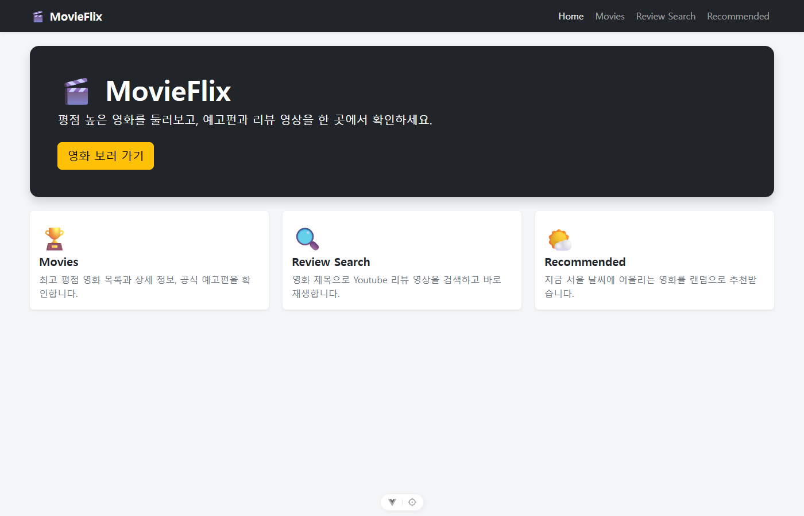
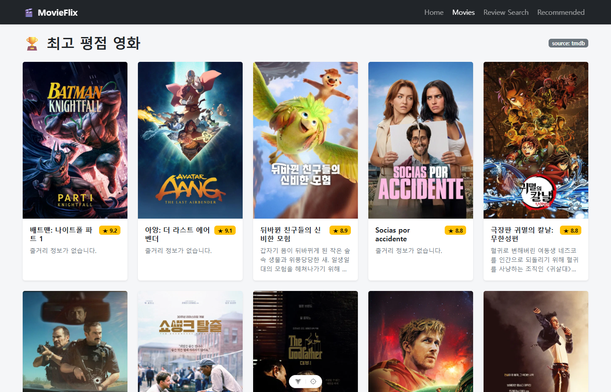
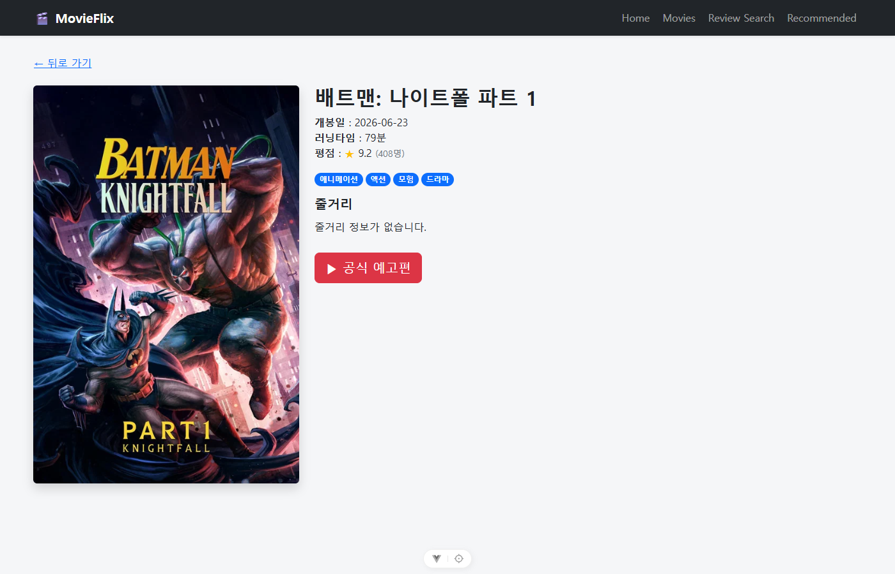
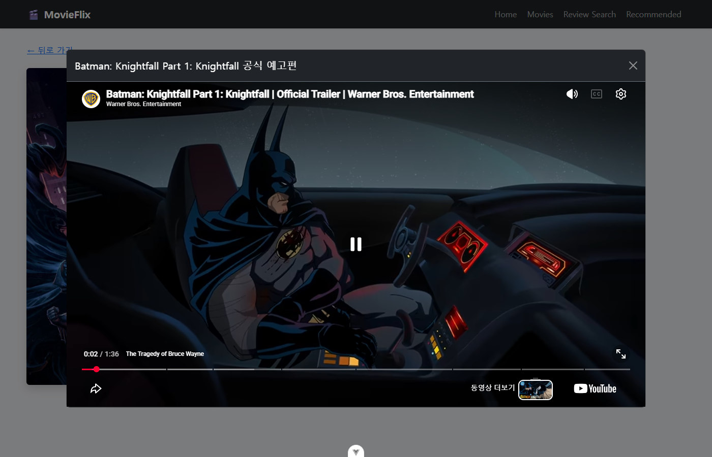
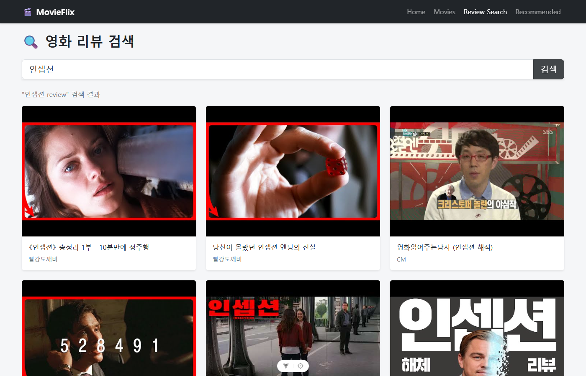
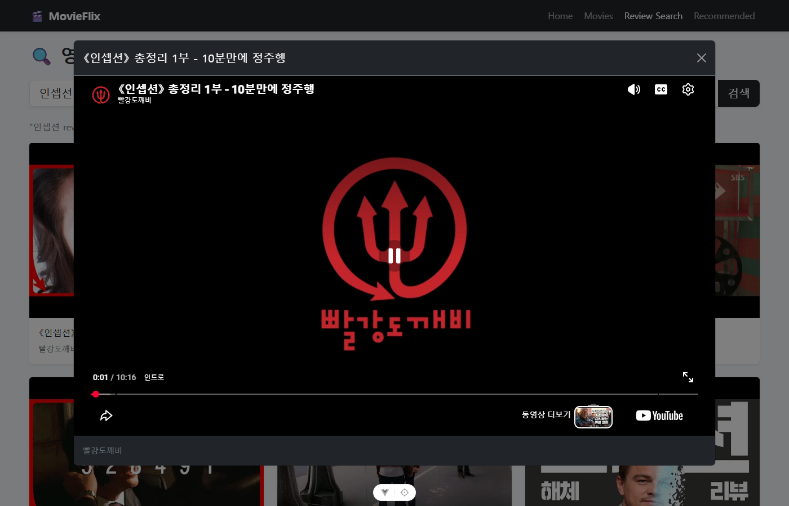
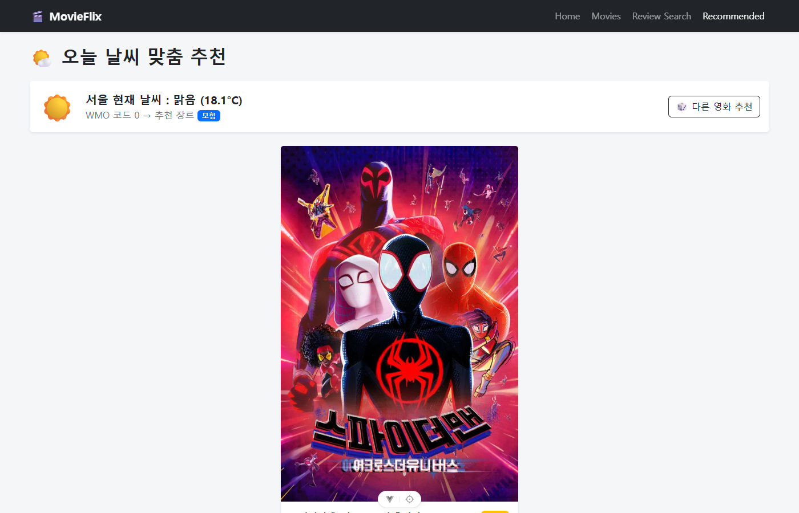

# 🎬 MovieFlix

> 영화 정보 탐색, 예고편·리뷰 영상 감상, 날씨 기반 영화 추천을 한 곳에서 제공하는 영화 서비스

TMDB, YouTube, Open-Meteo 세 가지 외부 API를 조합한 **Vue 3 SPA**와, 영화·출연진·리뷰 데이터를 직접 모델링해 영화 조회·추천·리뷰 CRUD와 토큰 인증을 제공하는 **Django REST API 서버**로 구성된 풀스택 개인 프로젝트입니다.
프론트엔드는 환경 변수 하나로 영화 데이터 출처를 **TMDB 직접 호출**과 **자체 Django API 서버** 사이에서 전환할 수 있습니다.



---

## 주요 기능

### 프론트엔드 (Vue SPA)

| 기능 | 설명 |
| :--- | :--- |
| **최고 평점 영화 목록** | TMDB Top Rated 영화를 포스터·제목·평점·줄거리 카드 그리드로 표시 |
| **영화 상세 정보** | 개봉일, 평점, 장르, 러닝타임, 줄거리 등 상세 정보 페이지 |
| **공식 예고편 재생** | 상세 페이지에서 버튼 하나로 YouTube 예고편을 모달로 재생 |
| **리뷰 영상 검색** | 영화 제목으로 YouTube 리뷰 영상을 검색하고 카드 클릭 시 모달로 바로 재생 |
| **날씨 기반 영화 추천** | 서울의 현재 날씨(WMO 코드)를 장르와 매칭해 영화 1편을 랜덤 추천, "다른 영화 추천" 재시도 지원 |
| **자체 API 서버 연동** | 데이터 출처를 Django로 전환하면 회원가입·로그인 후 발급받은 토큰으로 영화 목록·상세·추천을 자체 서버에서 받아옴 |

### 백엔드 (Django REST API)

| 기능 | 설명 |
| :--- | :--- |
| **영화 데이터 모델링** | Movie · Genre(M:N) · Cast(1:N) · Review(1:N) 관계 설계 및 CSV → fixture 변환 스크립트 |
| **영화/장르 조회 API** | 영화 목록(평점순)·상세 조회, 상세에 출연진·리뷰·장르를 중첩 직렬화 |
| **날씨 추천 API** | 장르 id를 받아 해당 장르 영화 중 1편을 랜덤으로 반환 (`Count` 집계 + 랜덤 offset) |
| **데이터 수집 파이프라인** | 제공 CSV에 없는 줄거리·포스터·평점을 TMDB API로 수집해 CSV로 저장, fixture 생성 시 병합 |
| **평점 집계** | ORM `Avg` / `Count` annotate로 영화별 평균 평점·리뷰 수 계산 |
| **리뷰 CRUD** | 리뷰 생성·조회·전체 수정(PUT)·부분 수정(PATCH)·삭제 |
| **회원가입/로그인 · 권한** | 토큰 인증 기반 회원가입·로그인, 리뷰 수정/삭제는 작성자 본인만 허용 |
| **API 테스트** | 엔드포인트별 정상·예외(400, 401, 403, 404) 케이스 16개 테스트 |

---

## 기술 스택과 선택 이유

### Frontend

| 기술 | 선택 이유 |
| :--- | :--- |
| **Vue 3 (Composition API, `<script setup>`)** | 컴포넌트별로 상태·비동기 로직을 함수 단위로 묶을 수 있어, 로딩/에러 상태가 많은 API 중심 화면을 간결하게 작성할 수 있음 |
| **Vite** | 네이티브 ESM 기반의 빠른 개발 서버와 HMR, `import.meta.env`로 API 키 등 환경 변수를 손쉽게 분리 |
| **Vue Router** | 목록 → 상세 → 검색 → 추천으로 이어지는 페이지 전환을 새로고침 없이 처리하는 SPA 구성 |
| **Pinia** | 로그인 토큰·사용자명을 여러 곳(네비게이션 바, 라우터 가드, API 인터셉터)에서 함께 써야 해서 전역 스토어로 관리 |
| **Axios** | `axios.create`로 API별 baseURL·인증·공통 파라미터를 인스턴스에 묶고, 인터셉터로 토큰 첨부·401 처리를 한 곳에서 담당 |
| **Bootstrap 5** | 그리드·카드·폼·네비게이션 바를 빠르게 구성하고, 커스텀 CSS는 카드 호버 효과와 텍스트 말줄임에 집중 |

### Backend

| 기술 | 선택 이유 |
| :--- | :--- |
| **Django 5 + Django REST Framework** | ORM으로 관계형 모델과 집계 쿼리를 표현하기 쉽고, Serializer로 중첩 응답과 입력 검증을 선언적으로 작성 가능 |
| **dj-rest-auth + django-allauth** | 회원가입·로그인·토큰 발급 엔드포인트를 검증된 라이브러리로 구성해 인증 구현에 드는 비용을 줄임 |
| **DRF TokenAuthentication** | SPA 클라이언트가 헤더 한 줄(`Authorization: Token ...`)로 인증할 수 있는 단순한 무상태 방식 |
| **django-cors-headers** | 프론트엔드(5173)와 API 서버(8000)의 출처가 달라 발생하는 CORS 문제를 허용 출처 지정으로 해결 |
| **SQLite** | 별도 설치 없이 바로 실행 가능한 개발용 DB, fixture로 동일한 초기 데이터 재현 |

### External API

| API | 용도 |
| :--- | :--- |
| [TMDB](https://developer.themoviedb.org/docs) | 영화 목록·상세·장르별 탐색 (한국어 `ko-KR` 응답) |
| [YouTube Data API v3](https://developers.google.com/youtube/v3/docs) | 예고편·리뷰 영상 검색 및 임베드 재생 |
| [Open-Meteo](https://open-meteo.com/en/docs) | API 키 없이 서울 현재 날씨(WMO 코드) 조회 |

---

## 아키텍처

```
[ my-vue-pjt · Vue 3 SPA ]
  views → components
    │
    ├─ api/movies.js ── 데이터 출처 추상화 (VITE_MOVIE_API_SOURCE)
    │     ├─ api/tmdb.js ───────────▶ TMDB API
    │     └─ api/django.js ─────────▶ 자체 Django API  (Authorization: Token <key>)
    ├─ api/youtube.js ──────────────▶ YouTube Data API
    ├─ api/weather.js ──────────────▶ Open-Meteo API
    └─ stores/auth.js (Pinia) ── 로그인 토큰 보관, 라우터 가드·axios 인터셉터에서 사용

[ django-pjt · Django REST API ]
  accounts/  User, 회원가입·로그인 (dj-rest-auth, Token)
  movies/    Movie · Genre · Cast · Review, 조회·추천·리뷰 CRUD API
  problem/   TMDB 데이터 수집, CSV → fixture 변환
```

---

## 기술적 고민과 해결

1. **데이터 출처를 바꿔도 화면 코드는 그대로**
   뷰가 TMDB를 직접 호출하지 않고 `api/movies.js`만 바라보도록 추상화 레이어를 두었습니다. 백엔드 Serializer가 TMDB와 같은 필드명(`poster_path`, `overview`, `vote_average`)을 반환하도록 맞춰, 환경 변수 `VITE_MOVIE_API_SOURCE`만 바꾸면 컴포넌트 수정 없이 자체 API 서버로 전환됩니다.
2. **동적 라우트와 정적 라우트 충돌**
   `/:movieId`가 `/movies`, `/review-search`까지 잡아먹는 문제를 `/:movieId(\\d+)` 정규식으로 숫자 ID만 매칭하도록 제한해 해결했습니다.
3. **같은 컴포넌트 안에서 이동 시 데이터가 갱신되지 않는 문제**
   `/278` → `/238`처럼 같은 상세 컴포넌트를 재사용하면 `onMounted`가 다시 실행되지 않습니다. `watch(() => route.params.movieId, ..., { immediate: true })`로 파라미터 변경을 감지했습니다.
4. **모달을 닫아도 영상 소리가 남는 문제**
   CSS로 숨기면 iframe이 살아 있어 재생이 계속됩니다. 모달을 `v-if`로 렌더링해 닫을 때 iframe을 DOM에서 제거하고, `Teleport`로 `body`에 붙여 z-index 문제를 피했습니다. ESC·배경 클릭 닫기는 공통 `VideoModalFrame`으로 재사용합니다.
5. **YouTube 제목의 HTML 엔티티 (`&#39;`, `&quot;`)**
   `v-html`은 XSS 위험이 있어, `DOMParser`로 텍스트만 안전하게 디코딩하는 유틸을 작성했습니다.
6. **TMDB 인증 방식 자동 판별**
   v3 API Key(쿼리 파라미터)와 v4 Read Access Token(`Bearer` 헤더)을 키 형태로 판별해 axios 인스턴스를 구성, 어떤 키를 넣어도 동작하게 했습니다.
7. **N+1 쿼리 방지**
   영화 상세는 출연진·리뷰·리뷰 작성자·장르를 함께 보여주므로 `prefetch_related` / `select_related`로 관련 데이터를 한 번에 조회했습니다.
8. **정제되지 않은 CSV 데이터 적재**
   출연진 `cast_id`가 영화마다 중복되고 리뷰 ID가 16진 문자열이며, 장르는 `"Animation, Family"` 같은 문자열이었습니다. 변환 스크립트에서 PK를 재부여하고 장르명을 TMDB 장르 ID로 매핑해 M:N 관계로 연결했습니다.
9. **화면에 필요한 데이터가 원본 CSV에 없음**
   카드와 상세 화면에는 줄거리·포스터·평점이 필요한데 제공 CSV에는 없었습니다. TMDB 상세 API로 수집하는 스크립트를 따로 두고 결과를 CSV로 저장해, API 키가 없는 환경에서도 같은 데이터로 재현되게 했습니다.
10. **인증이 필요한 API와 SPA 연동**
    모든 API가 토큰 인증을 요구하므로 Pinia 스토어에 토큰을 보관하고, axios 요청 인터셉터로 헤더를 자동 첨부했습니다. 라우터 가드로 비로그인 사용자를 로그인 페이지로 보내고(원래 가려던 경로는 `redirect` 쿼리로 보존), 401 응답 시에는 토큰을 지우고 다시 로그인하게 했습니다.
11. **랜덤 추천 쿼리**
    `order_by('?')`는 후보 전체를 랜덤 정렬하므로, `aggregate(Count('id'))`로 후보 수를 구한 뒤 랜덤 offset으로 1건만 조회했습니다.

---

## 실행 화면

| 화면 | |
| :--- | :--- |
| 최고 평점 영화 목록 |  |
| 영화 상세 정보 |  |
| 공식 예고편 모달 |  |
| 리뷰 영상 검색 |  |
| 리뷰 영상 모달 |  |
| 날씨 기반 추천 |  |

---

## 실행 방법

### Frontend

```bash
cd my-vue-pjt
npm install
cp .env.example .env   # API 키 입력 (자체 서버를 쓰려면 VITE_MOVIE_API_SOURCE=django)
npm run dev            # http://localhost:5173
```

### Backend

```bash
cd django-pjt
python -m venv venv && source venv/Scripts/activate
pip install -r requirements.txt
python problem/problem_a.py   # CSV → fixture 생성 (수집해 둔 TMDB 데이터 포함, 키 불필요)
python manage.py migrate
python manage.py loaddata users.json genres.json movies.json casts.json reviews.json
python manage.py runserver    # http://127.0.0.1:8000
```

각 파트의 상세 내용은 [Frontend README](my-vue-pjt/README.md), [Backend README](django-pjt/README.md)에 정리했습니다.
단계별 구현 과정과 설계 이유는 [구현 가이드](docs/IMPLEMENTATION_GUIDE.md)에서 자세히 볼 수 있습니다.

---

## 프로젝트 구조

```
movie_web/
├─ my-vue-pjt/     Vue 3 SPA (프론트엔드)
├─ django-pjt/     Django REST API (백엔드)
└─ docs/           구현 가이드, 실행 화면
```

## 향후 개선 계획

- 프론트엔드에서 리뷰 작성·수정·삭제 기능 제공 (백엔드 API는 구현 완료)
- 자체 서버의 영화 데이터 확장 (현재 20편)
- 사용자 위치 기반 날씨 조회 (Geolocation API)
